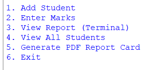

# 📚 Student Report Card Management System

A Python-based application that automates student record management and generates professional PDF report cards using SQLite and ReportLab.

---

## 📖 Overview

The Student Report Card Management System is designed to simplify the process of managing student records. It allows users to add students, update marks, calculate grades automatically, and generate professionally formatted PDF report cards.

---

## ✨ Features

- ➕ Add new student records
- ✏️ Update student marks
- 📊 Automatic percentage and grade calculation
- 🗄️ SQLite database integration
- 📄 Generate PDF report cards
- 👨‍🎓 View individual student reports
- 📋 View all student records

---

## 🛠️ Technologies Used

- Python
- SQLite
- ReportLab

---

## 📂 Project Structure

```
Student-Report-Card-Management-System/
│
├── report_card.py
├── reportcard.db
├── logo.png
├── Report_12.pdf
├── README.md
└── Project_Report.docx
```

---

## 📸 Sample Output

### Generated Report Card

*(Upload a screenshot of your generated PDF here and replace the line below.)*



---

## 🚀 How to Run

1. Install Python 3.x
2. Install ReportLab

```bash
pip install reportlab
```

3. Run the program

```bash
python report_card.py
```

---

## 📄 Documentation

The complete project documentation is available in:

- **Project_Report.docx**

---

## 🔮 Future Improvements

- GUI using Tkinter
- Login Authentication
- Excel Import/Export
- Email Report Cards
- Cloud Database Integration
- Performance Analytics Dashboard

---

## 👨‍💻 Author

**Parth Pal**

Class XII Informatics Practices Project (2025–2026)

---

⭐ If you found this project interesting, feel free to star the repository!
